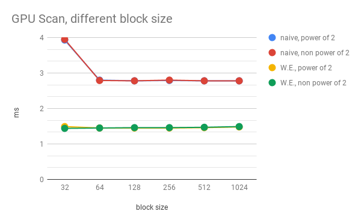
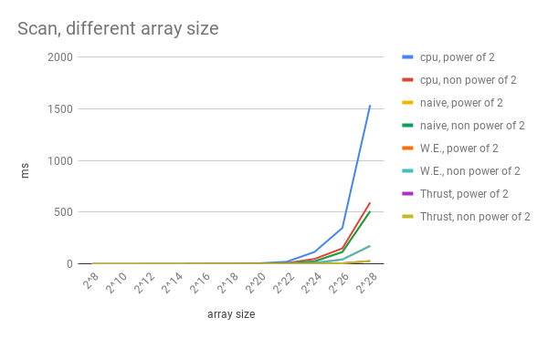
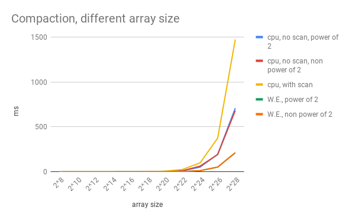

CUDA Stream Compaction
======================

**University of Pennsylvania, CIS 565: GPU Programming and Architecture, Project 2**

* Zichuan Yu
  * [LinkedIn](https://www.linkedin.com/in/zichuan-yu/), [Behance](https://www.behance.net/zainyu717ebcc)
* Tested on: Windows 10.0.17134 Build 17134, i7-4710 @ 2.50GHz 16GB, GTX 980m 4096MB GDDR5

## Features

- CPU Scan
- CPU Stream Compaction
- Naive GPU Scan
- Work-Efficient GPU Scan
- Work-Efficient GPU Stream Compaction
- Thrust Implementation

## Performance Analysis

### Block size analysis

We fix array size as 2^21 and change the block size.



As we can see, as long as the block size is not 32, it makes little differences when we increase the block size.

### Array Size Analysis on Scan

We fix block size as 1024 and change the array size.



As we can see, CPU is of course the slowest. We can also see that my own implementation is still much slower than
Thrust implementation. I think this is because our own code is still not efficient and hardware-exploiting enough.

### Array Size Analysis on Compaction

We fix block size as 1024 and change the array size.



As we can see, CPU with scan is the slowest. I think that scan brings overhead to CPU, thus, if we are using CPU, we'd rather not use scan at all.

## Output

Array size 2^28, block size 1024

```shell

****************
** SCAN TESTS **
****************
    [   1   1   1   1   1   1   1   1   1   1   1   1   1 ...   1   1 ]
==== cpu scan, power-of-two ====
   elapsed time: 1535.85ms    (std::chrono Measured)
    [   0   1   2   3   4   5   6   7   8   9  10  11  12 ... 268435454 268435455 ]
==== cpu scan, non-power-of-two ====
   elapsed time: 594.798ms    (std::chrono Measured)
    [   0   1   2   3   4   5   6   7   8   9  10  11  12 ... 268435451 268435452 ]
    passed
==== naive scan, power-of-two ====
   elapsed time: 510.046ms    (CUDA Measured)
    [   0   1   2   3   4   5   6   7   8   9  10  11  12 ... 268435454 268435455 ]
    passed
==== naive scan, non-power-of-two ====
   elapsed time: 510.037ms    (CUDA Measured)
    [   0   1   2   3   4   5   6   7   8   9  10  11  12 ...   0   0 ]
    passed
==== work-efficient scan, power-of-two ====
   elapsed time: 175.304ms    (CUDA Measured)
    [   0   1   2   3   4   5   6   7   8   9  10  11  12 ... 268435454 268435455 ]
    passed
==== work-efficient scan, non-power-of-two ====
   elapsed time: 175.151ms    (CUDA Measured)
    passed
==== thrust scan, power-of-two ====
   elapsed time: 28.8416ms    (CUDA Measured)
    passed
==== thrust scan, non-power-of-two ====
   elapsed time: 28.8394ms    (CUDA Measured)
    passed

*****************************
** STREAM COMPACTION TESTS **
*****************************
    [   0   1   0   0   1   0   3   1   3   3   0   3   1 ...   3   0 ]
==== cpu compact without scan, power-of-two ====
   elapsed time: 708.621ms    (std::chrono Measured)
    [   1   1   3   1   3   3   3   1   1   1   1   1   1 ...   1   3 ]
    passed
==== cpu compact without scan, non-power-of-two ====
   elapsed time: 680.761ms    (std::chrono Measured)
    [   1   1   3   1   3   3   3   1   1   1   1   1   1 ...   1   1 ]
    passed
==== cpu compact with scan ====
   elapsed time: 1471.92ms    (std::chrono Measured)
    [   1   1   3   1   3   3   3   1   1   1   1   1   1 ...   1   3 ]
    passed
==== work-efficient compact, power-of-two ====
   elapsed time: 213.044ms    (CUDA Measured)
    passed
==== work-efficient compact, non-power-of-two ====
   elapsed time: 212.931ms    (CUDA Measured)
    passed
Press any key to continue . . .
```


